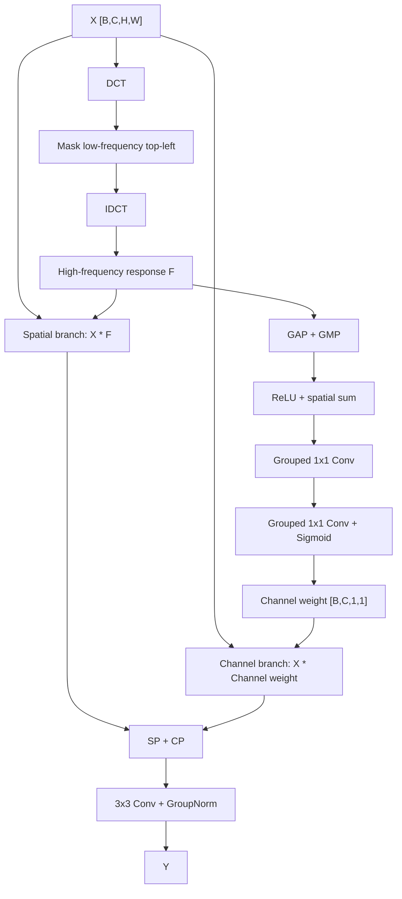
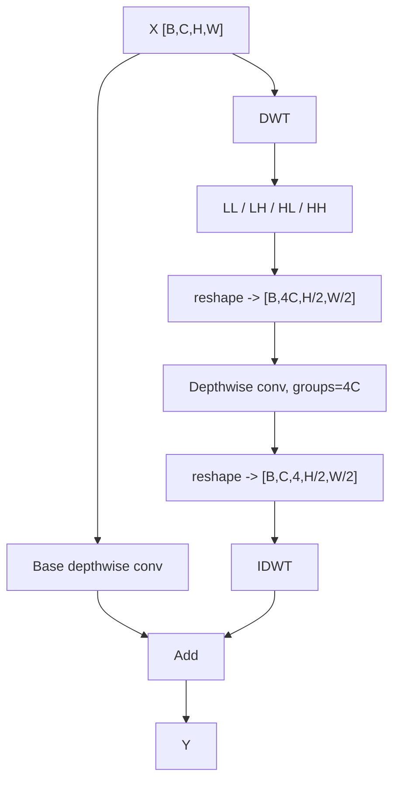
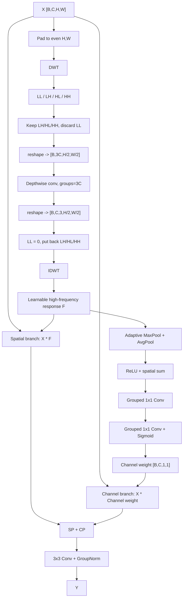
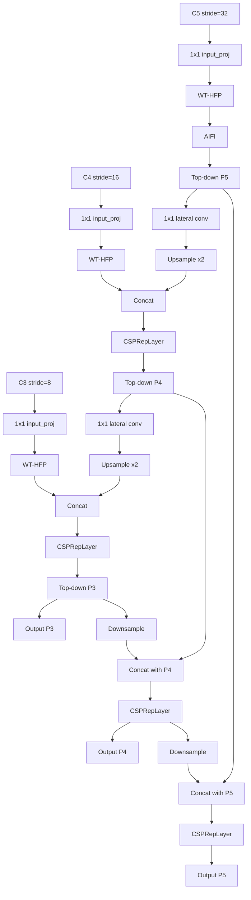

# HFP、WTConv 与当前 WT-HFP 模块学习笔记

这份笔记整理了我们前面讨论过的内容：HFP 的原理、WTConv 的原理、DCT/DWT 中高低频的含义，以及当前在 RT-DETRv2 中实现的 WT-HFP 模块。它不是论文正文，可以作为理解模块、写方法部分和画结构图的底稿。

## 1. 频率到底是什么意思

图像或特征图里的“频率”，可以先粗略理解成数值变化的快慢。

```text
变化慢 = 低频
变化快 = 高频
```

在图像中：

- 大片平滑区域、整体亮度、缓慢变化的背景，通常偏低频。
- 边缘、纹理、局部突变、细碎结构，通常偏高频。
- 同一个物体内部如果颜色和亮度变化平缓，偏低频。
- 不同物体的边界、火焰边缘、烟雾轮廓的突变部分，偏高频。

但这个判断不是绝对的。比如火焰既有高频边缘，也有低频光晕；烟雾整体偏低频，但烟雾边缘或复杂背景下也可能有高频响应。

## 2. 为什么检测任务会关注高频

小目标在特征图中占据的像素很少。经过 backbone 多次卷积和下采样后，小目标的空间细节更容易被背景和语义信息淹没。

HFP 的基本出发点是：

```text
小目标可用像素少
↓
边缘、纹理、局部突变这些高频细节更珍贵
↓
增强高频响应，可以让小目标区域在特征图中更突出
```

这也是 HS-FPN 论文中增强高频信息的核心动机。它不是说“低频无用”，而是说在 tiny object detection 中，低频背景容易占主导，高频细节能提高小目标的显著性。

## 3. DCT 是怎么做高频提取的

DCT 可以把一个空间特征图变换到频率域。DCT 后的矩阵不是简单地把数值从大到小排序，而是每个位置对应一种固定的余弦频率模板。

以二维 DCT 为例：

```text
DCT(X)[u, v]
```

表示原特征图 `X` 和第 `(u, v)` 个余弦频率模板的相似程度。

其中：

- 左上角 `(0,0)` 是最低频，接近整张图的平均趋势。
- 越往右，水平方向频率越高。
- 越往下，垂直方向频率越高。
- 右下角通常表示水平和垂直方向都变化很快的高频成分。

因此 HFP 中的 DCT 高频提取通常是：

```text
X
↓
DCT(X)
↓
把左上角低频区域 mask 掉
↓
IDCT
↓
得到高频响应 F
```

IDCT 的意义是：把频率域中保留下来的高频成分重新变回空间特征图，这样后面才能和原始特征 `X` 做逐元素相乘。

## 4. HFP 的原始结构

HFP 来自 HS-FPN。它的目标是从高频角度增强 FPN lateral feature 中的小目标细节。

整体结构可以写成：

```text
X
↓
DCT 高频响应 F
↓
空间分支：X * F
通道分支：X * channel(F)
↓
两支相加
↓
3x3 Conv + GroupNorm
↓
Y
```

结构图：



### 4.1 空间分支做什么

空间分支看的是每张特征图上的哪个位置重要。

如果把 `X [C,H,W]` 理解成很多张正方形纸叠在一起：

```text
空间分支 = 看每张纸上哪些位置更重要
```

HFP 中直接用高频响应 `F` 作为空间增强信号：

```text
Spatial = X * F
```

高频强的位置，通常对应边缘、纹理、小目标细节。

### 4.2 通道分支做什么

通道分支看的是哪些通道更重要。

还是用“很多张纸叠起来”的比喻：

```text
通道分支 = 看哪几张纸更重要
```

HFP 不是直接对原始 `X` 做通道注意力，而是先从高频响应 `F` 中提取通道信息：

```text
F
↓
GAP + GMP
↓
ReLU + spatial sum
↓
1x1 grouped conv
↓
sigmoid
↓
channel weight
```

原因是：小目标在整张特征图中占比很小，如果直接对 `X` 做全局池化，通道权重容易被大面积低频背景主导。先提取高频响应，再做通道注意力，可以让通道权重更偏向小目标细节。

## 5. HS-FPN 的完整用法

HS-FPN 不是单独一个 HFP 模块，而是把普通 FPN 的 lateral connection 改成了 `HFP + SDP`。

原论文结构大致是：

```text
Backbone
↓
C2, C3, C4, C5
↓
1x1 Conv 统一到 256 通道
↓
HS-FPN top-down
↓
P2, P3, P4, P5
```

每条 lateral connection 中：

```text
Ci -> HFP -> SDP -> 与上层 Pi+1 融合 -> Pi
```

其中：

- 所有 lateral 都有 HFP。
- P2/P3/P4 有 SDP。
- P5 没有 SDP。

当前我们的 RT-DETRv2 版本没有完整复现 HS-FPN。当前更准确叫：

```text
HFP-inspired / WT-HFP-enhanced RT-DETR HybridEncoder
```

因为当前 RT-DETRv2 只有 C3/C4/C5 三层，没有 C2/P2，也没有 SDP。

## 6. DWT 是什么

DWT 是离散小波变换。它和 DCT 都能做频率分解，但关注点不一样。

```text
DCT 更偏全局频率
DWT 更偏局部、多尺度频率
```

以 Haar 小波为例，一个 2x2 小块：

```text
a b
c d
```

可以变成四个子带：

```text
LL = (a + b + c + d) / 2
LH = (a - b + c - d) / 2
HL = (a + b - c - d) / 2
HH = (a - b - c + d) / 2
```

可以粗略理解为：

- `LL`：局部平均趋势，低频。
- `LH`：一种方向上的边缘变化。
- `HL`：另一种方向上的边缘变化。
- `HH`：对角线、纹理、复杂变化。

DWT 对整张图不是只产生一个值，而是对局部区域做分解，最后形成四张子带特征图：

```text
X [B,C,H,W]
↓
DWT
↓
[B,C,4,H/2,W/2]
      ├── LL
      ├── LH
      ├── HL
      └── HH
```

## 7. WTConv 的原理

WTConv 的核心不是“只做 DWT”，而是：

```text
DWT + 子带 depthwise conv + IDWT
```

它的思想是用小波分解扩大卷积感受野，同时保留局部频率结构。

典型流程：

```text
X
↓
DWT -> LL / LH / HL / HH
↓
把 4 个子带 reshape 成 [B,4C,H/2,W/2]
↓
depthwise conv, groups = 4C
↓
reshape 回 [B,C,4,H/2,W/2]
↓
IDWT
↓
和普通 depthwise conv 分支相加
↓
Y
```

结构图：



WTConv 不是注意力模块，也不会显式告诉模型“哪里该增强高频、哪里该增强低频”。它更像是一个带小波先验的大感受野 depthwise convolution。

## 8. DCT 和 DWT 的区别

| 对比项 | DCT | DWT |
|---|---|---|
| 频率表达 | 全局余弦频率模板 | 局部小波子带 |
| 低频位置 | 频域矩阵左上角 | LL 子带 |
| 高频位置 | 远离左上角的区域 | LH/HL/HH 子带 |
| 空间定位 | 较弱，偏全局 | 较强，保留局部块结构 |
| 适合做什么 | 全局频率筛选、高低频 mask | 局部边缘/纹理/趋势建模 |

因此：

```text
HFP 用 DCT：适合做全局高频响应筛选
WTConv 用 DWT：适合做局部高低频子带卷积
```

## 9. 当前 WT-HFP 的最终设计

经过几轮讨论，我们最后确定的版本是：

```text
X
↓
DWT -> LL / LH / HL / HH
↓
对 LH / HL / HH 做 depthwise conv
↓
IDWT 得到可学习的高频响应 F
↓
HFP 空间分支：X * F
HFP 通道分支：X * channel(F)
↓
两支相加
↓
3x3 Conv + GroupNorm
↓
Y
```

结构图：



这个版本可以这样解释：

```text
HFP 提供结构框架：
高频响应 + 空间分支 + 通道分支 + 3x3输出头

WTConv 提供小波子带卷积思想：
在 LH/HL/HH 高频子带上做 depthwise conv

当前 WT-HFP：
用可学习的小波高频响应替代原 HFP 的 DCT 高频响应
```

## 10. 当前模块放在 RT-DETRv2 的哪里

当前配置中：

```yaml
use_wt_hfp: True
wt_hfp_apply_idx: [0, 1, 2]
```

对应 C3/C4/C5 三层都插入 WT-HFP。

实际数据流是：

```text
Backbone 输出 C3/C4/C5
↓
input_proj 统一到 256 通道
↓
WT-HFP(C3), WT-HFP(C4), WT-HFP(C5)
↓
C5 进入 AIFI
↓
Top-down FPN: upsample + concat + CSPRepLayer
↓
Bottom-up PAN: downsample + concat + CSPRepLayer
↓
输出 P3/P4/P5 给 decoder
```

结构图：



注意这里不是传统 FPN 的相加融合，而是 RT-DETR 的：

```text
concat([upsample high feature, low feature]) -> CSPRepLayer
```

## 11. 为什么这个设计比简单 DWT-HFP 更合理

如果只做：

```text
DWT -> 去掉 LL -> IDWT
```

那么高频响应是固定小波滤波得到的，学习能力弱。

现在做：

```text
DWT -> LH/HL/HH depthwise conv -> IDWT
```

好处是：

- 高频响应仍然来自明确的小波高频子带，有频率先验。
- depthwise conv 让每个通道、每个高频方向可以学习自己的滤波方式。
- 仍然保持 HFP 的空间分支和通道分支，论文叙事更干净。
- 计算量比完整 attention 类模块小，结构也比低/高频双门控更容易解释。

## 12. 和原模块的关系

当前 WT-HFP 和 HFP、WTConv 的关系可以概括为：

```text
不是直接采用 HFP：
因为高频响应不是 DCT 生成，而是 DWT + 高频子带 depthwise conv 生成。

不是直接采用 WTConv：
因为它不是替换普通卷积，也没有 base depthwise conv + wavelet branch 相加。

它是一个融合模块：
HFP 的两分支注意力结构 + WTConv 的小波子带 depthwise conv 思想。
```

论文里可以表述为：

```text
Inspired by HFP and WTConv, we design a wavelet high-frequency perception
module. The proposed module replaces the DCT-based high-pass generator in HFP
with a learnable DWT high-frequency generator, where the LH, HL, and HH
subbands are refined by depthwise convolution before inverse wavelet
reconstruction.
```

中文可以写成：

```text
受 HFP 与 WTConv 启发，本文设计了一种小波高频感知模块。
该模块保留 HFP 的空间分支和通道分支结构，但将原本基于 DCT 的高频响应生成器
替换为基于 DWT 的可学习高频响应生成器。具体而言，输入特征经 DWT 分解后，
仅对 LH、HL、HH 高频子带进行深度卷积建模，再通过 IDWT 重建高频响应，
用于引导空间和通道两个维度的特征增强。
```
